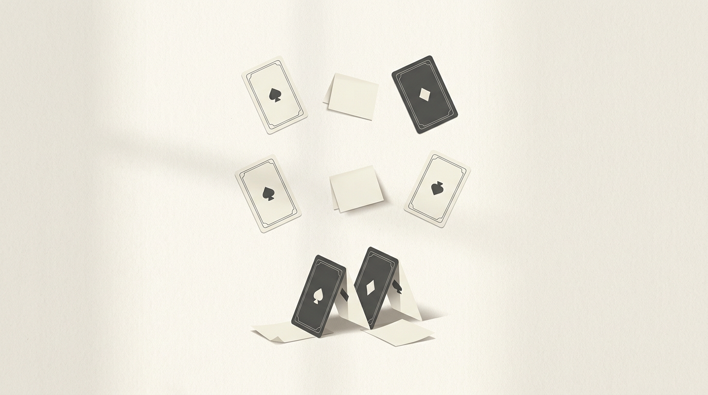

# 高效能人士七个习惯培训感悟
**第二次培训：第 4、5、6 习惯 | 钱晓炯 | 2026-03-23**

---

这次培训真正留下来的，不是几个概念，而是几次具体的卡顿和不舒服。老师讲得不算多，更多时候是在让我们亲自去做，去碰壁，去暴露平时不容易看见的习惯。

回头看，我印象最深的不是“学到了什么道理”，而是自己在几个场景里的反应：有时候习惯旁观，有时候急着下判断，有时候总想多管一点，结果反而把事情弄复杂了。两天下来，有三个片段我觉得值得认真记下来。

---

## 一、纸牌屋：拖慢团队的，常常不是执行力，而是信息怎么被组织

### 游戏规则

三排人员：第一排 1 人（A），第二排 2 人，第三排 4 人。目标是让每个人手里的牌最终变成同一花色或同一数字。沟通只能在相邻排之间通过纸条传递，同排之间不能沟通，可以互相交换牌，但每次只能换一张。

### 两次结果

第一次：最快的组花了 40 分钟，有的组没有完成。  
第二次：最快 3 分钟，平均 5 分钟。

同样的规则，前后差了这么多，一开始我也只是觉得“第二次大家更熟了”。后来再想，事情没有这么简单。

### 我后来觉得，第一次慢，不只是因为不会玩

- 只有 A 知道目标，信息天然卡在最前面。
- 目标本身也不够确定，按花色还是按数字，看起来只是两种选择，实际上可能一开始就决定了是不是死局。
- 信息最集中的人最忙，信息最少的人反而只能等，整个组织虽然人很多，但真正能动起来的人不多。

换句话说，问题不完全出在执行，而是出在信息结构本身。

### 第二次为什么快了很多

第二轮之所以明显变快，不是因为大家突然更聪明了，而是目标被说清楚了，信息也分发得更彻底了。

普通一点的做法，是 A 先判断方向，再由中间层分头协调。这样已经比第一轮顺很多。

更好的做法，是 A 在收集完关键信息之后，直接告诉每个人自己最终要什么。每个人一旦知道自己的目标，就不需要反复等指令，也不需要一层层传话，只要把不属于自己的牌交换出去就行。这样一来，沟通成本会骤降，执行自然就快了。

这个游戏对我触动很大。以前我有时会把“效率低”简单理解成执行不到位，或者下意识觉得是配合的人不够主动。现在看，很多时候真正的问题在更前面：目标是不是足够清楚，信息是不是到了该到的人手里，原本可以并行的事情，是不是被设计成了层层等待。

最近在用 AI 工具做事时，我也会想到这一点。不是把要求拆得越碎越好，也不是一句话丢过去等奇迹发生。更重要的，还是把目标、约束和上下文说明白，然后给执行留出空间。人和工具其实都一样，最怕的是目标模糊、路径拥堵。

### 这件事里我看到的“双赢”

还有一个细节让我印象很深：A 如果只想着先把自己的牌凑齐，整局反而走不通。真正有效的路径，反而是先让下面的人逐步接近完成，最后自己自然也会完成。

表面看像是在“先顾别人”，其实是在为整体打开通路。很多协作场景也是这样，真正的利己，往往并不是先把自己的那一小块抓牢，而是先让整个系统流动起来。

另一个让我有点惭愧的地方是，我们几乎默认把别的组当成了竞争对手。可老师后来提醒我们，这个游戏从头到尾都没要求分胜负，只要求大家尽快完成。规则里没有写“竞争”，竞争是我们自己脑补出来的。

这句话让我有点警醒。现实里很多关系，也许本来并不是零和的，只是我们太习惯先把别人放进“对手”的位置。

---

## 二、43 分钟事件：我以为自己没做错，其实只是站在一边

培训第二天早上，9 点已到，人还没完全到位。我和同事在聊天，看着大家也还没有真正进入状态，就顺势继续聊了下去。后来老师直接把大家请到走廊里反思，前前后后花了 43 分钟，现场才重新回到正轨。

当时那一下其实挺不舒服的。第一反应甚至会想，是不是老师太严了。可过后冷静下来，我得承认，更大的问题还是在自己。

我那时候不是明显的破坏者，但也绝不是一个真正进入状态的人。我明明知道培训应该开始了，却把自己的判断悄悄交给了现场氛围：既然大家都还没准备好，那我先松着也没什么。这种心理很常见，也很隐蔽。它让人觉得自己“也没做错什么”，但实际上已经把责任往外推了一步。

所以这件事对我的提醒，不只是“要主动积极”，而是另一层更具体的东西：人在群体里，很容易把自己的状态外包给别人。一旦没有人先站出来，所有人都会变得更松散。

很多时候，所谓主动，并不是去做多大的事，而是在该归位的时候，先把自己放回到该在的位置。

---

## 三、齐眉棍：很多失败，不是没人负责，而是每个人都想多负责一点

### 游戏规则

二十多个人，每人伸出一根手指，共同托住一根四五米长的塑料棍，目标是把棍子慢慢放到地面。手指不能离开棍子。

预计用时：10 秒到 1 分钟。  
实际用时：50 多分钟。

最开始大家都觉得这事不会难，结果棍子不但放不下去，反而越升越高，像故意跟人作对一样。

### 为什么会这样

后来再看，原理并不复杂。因为手指不能离开棍子，所以每个人都会下意识给一点向上的支撑力，生怕问题出在自己这里。人一多，每个人都“多给一点”，合起来就成了一个明显的向上力量。

这个过程让我特别有感触。很多协作失控，不是因为没人上心，恰恰是因为每个人都太想把事情弄对。于是会忍不住提醒、纠正、补位、发力。动机也许是好的，但结果往往是系统被一起推偏。

后来能慢慢把棍子放下来，不是因为大家更用力了，而是因为大家开始收力，把注意力从“别人有没有做好”收回到“我这一指是不是给多了”。局面稳定下来以后，事情反而开始真正往前走。

这件事对我的提醒很直接：并不是所有问题都需要我去推动、去纠偏、去证明自己在负责。有些时候，最难的不是行动，而是克制。

---

## 四、三个场景放在一起：比起背道理，更难的是分清眼前是哪种局面

把这三个片段放在一起，会发现它们之间其实有一种张力。

- 在 43 分钟事件里，问题是没人愿意先归位。
- 在齐眉棍里，问题是每个人都忍不住多加了一点力。
- 在纸牌屋里，问题又变成目标和信息没有被正确组织。

所以，同样是“积极”，有时意味着要先站出来，有时反而意味着少插手一步；同样是“做好自己”，有时已经足够，有时又远远不够。

这次培训真正打动我的，不是某一条习惯本身，而是它让我意识到：不能拿一个正确的道理去覆盖所有场景。道理没有错，错的是我总想用一个简单答案去处理复杂问题。

---

## 五、关于统合综效：不是谁说服谁，而是一起把答案做出来

关于统合综效，老师提到一句话：**100% 的信念，加上无穷多的方法。**

以前听到这种话，我可能会先把重点放在“信念”和“方法”上。现在我更愿意把它理解成另一层意思：信念，不是嘴上说一定能成，而是在出现分歧的时候，不急着把别人排除出去；方法，也不是越多越好，而是愿意承认自己手里的那一套，并不一定最完整。

工作里最常见的僵局，往往不是没有方法，而是每个人都太急着证明自己是对的。一旦进入这种状态，差异就不再是资源，而会变成立场。

真正的统合综效，也许不是“我想得更全面”，而是我愿不愿意把自己的方法放到桌面上，同时也给别人的方法留出位置。最后形成的那个方案，很多时候并不完全属于任何一个人，但它往往比每个人单独坚持的版本都更好。

---

## 六、关于 1 号位：方向重要，但判断方向时更要谦卑

纸牌屋里有一个关键前提：如果 A 一开始选错目标，后面越努力，消耗可能越大。这个提醒很现实，方向确实比努力更重要。

但这次培训之后，我对这句话也多了一层警惕。说“方向重要”并不难，难的是承认自己对方向的判断并不总是那么可靠。很多事在当下其实看不清，外人也给不了标准答案。

真正难的，不只是做选择，而是在不确定里一边往前走，一边校正自己。不把一时的判断当成真理，也不因为不确定就迟迟不肯行动。

如果要给自己留一句话，我更愿意记这个：方向要尽量想清楚，行动要尽力，判断要保持谦卑。

---

*整理自 2026-03-20 至 2026-03-21《高效能人士七个习惯》第二次培训（第 4/5/6 习惯）*
