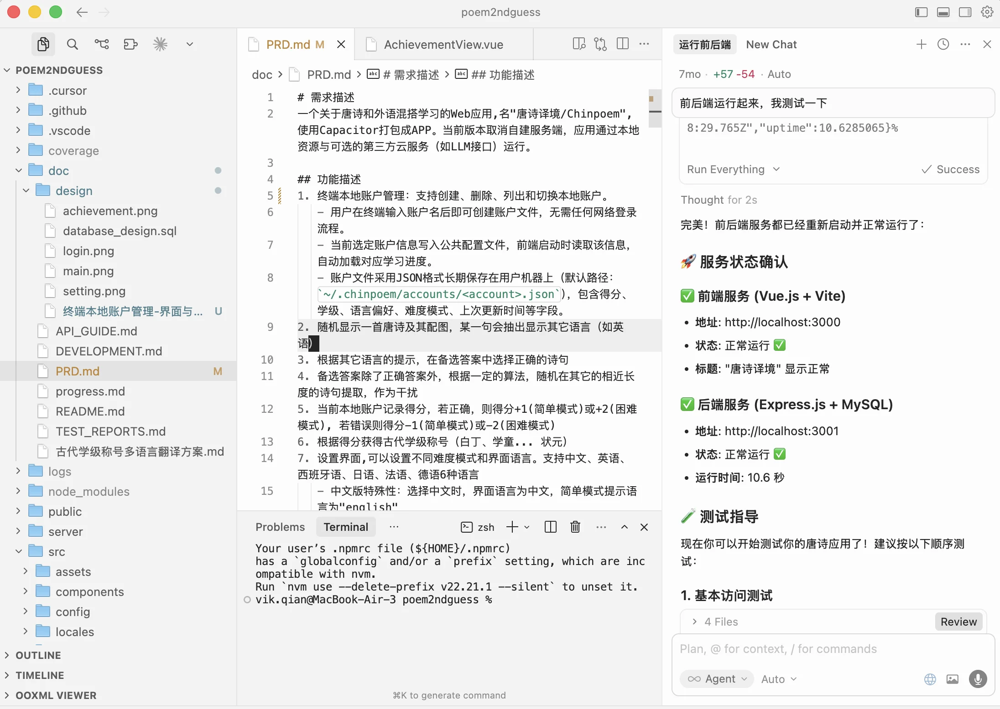
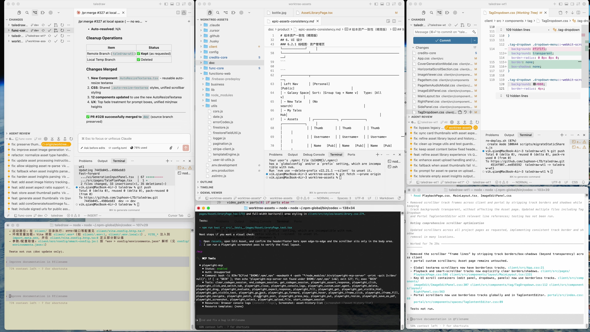
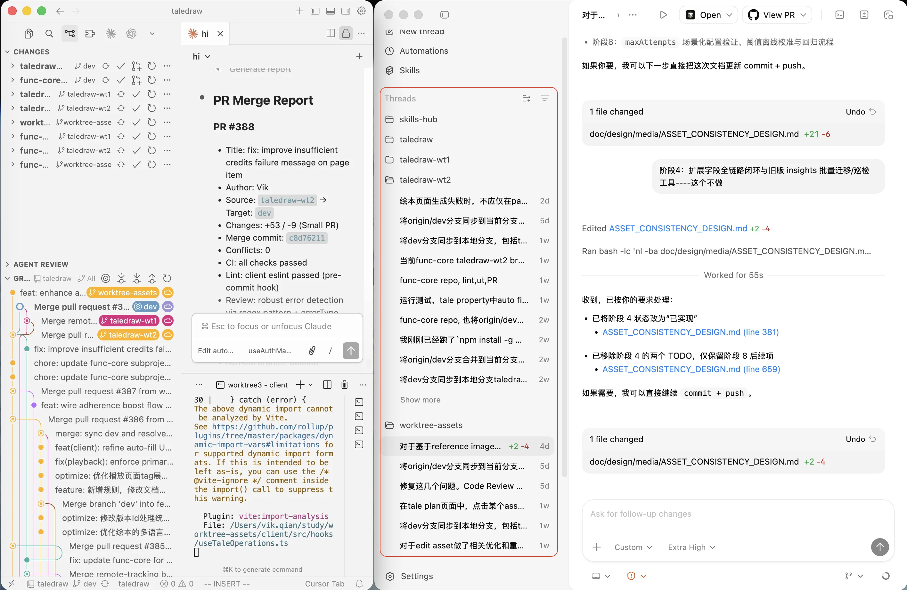
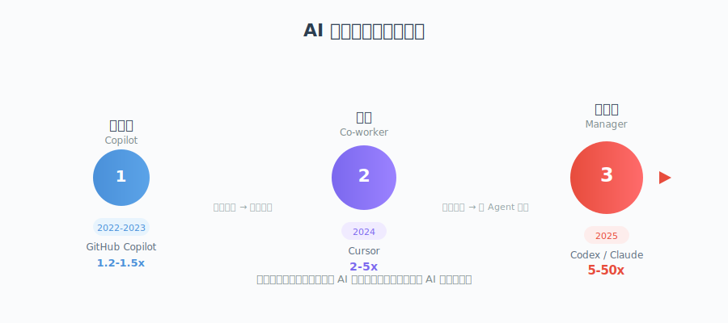

# AI 编程的三个阶段：从副驾驶到团队指挥官

> 当编程能力不再稀缺，管理能力成为新的护城河。

---

## 引言

过去两年，AI 编程工具经历了飞速演进。从最初的代码补全，到对话式协作开发，再到如今的多 Agent 并行自主开发——我们正在见证软件开发范式的根本性转变。

本文基于我个人从 GitHub Copilot 到 Cursor，再到 Codex Agent 的实践经历，梳理 AI 编程的三个阶段，以及每个阶段对开发者能力模型的不同要求。

---

## 第一阶段：副驾驶（Copilot）——代码补全与对话辅助

我最早接触 AI 编程，是微软联合 OpenAI 推出的 GitHub Copilot。它的核心能力是**代码自动补全**：你写上半句，它猜下半句。辅以基于对话的问答，帮你理解 API、生成代码片段。

这个阶段的特点：

- **人是主体**，AI 是工具
- AI 的作用范围局限在"当前光标附近"
- 开发者仍需完整掌握编程语言和框架知识
- 效率提升有限，主要节省的是"查文档"和"敲重复代码"的时间

---

## 第二阶段：搭档（Co-worker）——对话式协作开发

后来，我参加了一次杭州 TGO 鲲鹏会的活动。杭州分会会长"肉山"介绍了他用 Cursor 进行 AI 编程的经验：设定编码规则（Rules）、编写清晰的需求规格、以测试驱动的方式开发。他提出了一个大胆的概念——**10 倍效率工程师**。

受此启发，我下载了 Cursor，开始尝试更深度的 AI 协作开发。

### 实践：从原型到产品

我的做法是：先在脑中构思功能，用在线原型设计工具（比 Figma 更轻量的 SaaS 工具）画出界面原型，然后将效果图和功能需求一起交给 Cursor。

这种体验像是**边说边做的搭档**——我描述需求，AI 实时实现。它不再只是补全代码，而是能理解意图、生成完整的功能模块。

我先后做了几个项目：

- **知识库学习与考试系统**（基于大语言模型，后因 Google NotebookLM 做得更好而放弃）
- **地理位置猜谜游戏**
- **唐诗教育游戏**（含多语言版本）

### 这个阶段的特点

- **人和 AI 是平等的搭档**，类似结对编程
- 人工参与仍然较重：素材收集、脚本编写、批量处理
- 典型模式：人提需求 → AI 生成代码 → 人审查调整 → 循环迭代
- 效率提升明显，但受限于"一次只能做一件事"

---

## 第三阶段：指挥官（Manager）——多 Agent 并行自主开发

真正的质变发生在最近。

在开发 **TaleLens**（一款 AI 绘本生成工具）的过程中，我的角色从"搭档"悄然转变为**"AI 团队的管理者"**。TaleLens 利用大模型生成绘本提示词，再通过提示词生成图片，最终将图文整合为完整绘本。项目前期的工作方式与之前类似，但随着项目复杂度增加，我发现自己越来越像一个**项目经理**，而非程序员。

### 管理者的工作方式

#### 1. 定规则——像给团队定编码规范

和之前一样，首先要设定编码规则、编码风格、技术栈选型。但这只是起点。

#### 2. 需求工程——从模糊想法到规格化文档

从用户视角提出需求，让 AI 生成规格化的需求文档，再生成设计方案。设计确定后，明确测试用例和验收标准：

- **功能性验收**：从用户视角定义输入输出
- **非功能性验收**：性能要求、响应时间、内存占用
- **模块间契约**：模块划分后，定义模块之间的接口和数据流

#### 3. 任务拆分——敏捷 Sprint 模式

将大模块拆分为多个阶段（Sprint），每个阶段包含若干小任务，每个任务都有清晰的描述和验收标准。

以 TaleLens 的"资产服务"为例：

| Sprint | 任务 | 验收标准 |
|--------|------|----------|
| 阶段一 | 资产 CRUD | 增删改查接口通过单元测试 |
| 阶段二 | 资产引用与参考 | 跨模块引用关系正确建立 |
| 阶段三 | 资产转化与生成 | 图片转资产、上下文生成资产功能可用 |

每个阶段设置检查点：不仅检查用户层面的输入输出，还检查数据库状态、日志输出、内存占用和处理时间。

#### 4. 并行执行——多 Agent 同时工作

准备工作就绪后，真正的魔法开始了。

我使用 **Codex**（OpenAI 的编程 Agent）作为主力工具。选择它的原因：编程质量高、输出简洁、成功率高、能长时间自主工作。

**具体操作方式：**

- 在同一个仓库下，通过 Git **worktree** 开辟多个独立工作空间
- 每个 worktree 对应一个 Codex Agent 实例，处理不同模块/阶段的任务
- 设定安全边界：Agent 不能直接提交到 `dev` 或 `main` 分支，只能在当前 worktree 分支上自由操作
- 在 worktree 内部，Agent 拥有充分的权限：读写代码、查询数据库、检查日志、操作网页和界面
- 工作完成后，由我审查并通过 PR 合并到 `dev` 分支

**桌面布局：**

每个 Codex Client 旁边配一个 IDE（如 Cursor），用于查看代码变更和分支提交情况。多套并行时需要一块大屏幕来管理。

#### 5. 新工具的演进

最近推出的 **Codex APP** 和 **OpenCode** 也开始支持 **Thread** 模式——每个 Thread 对应一个 worktree，本质上与多 Client 方案类似，但界面更加整洁。配合 Cursor IDE 订阅不同 worktree 的 Git 变更，可以在一个界面中监控所有 Agent 的工作进展。

这样就实现了：**同时指挥多个 AI Agent，以 Agentic 方式长时间自主工作**——有的 Agent 连续工作数小时甚至十几个小时，就像一个真正的团队成员。

---

## 软件工程没有死，管理学正在复兴

大约一个月前，一个叫 **Ralph Loop** 的工具火了一阵。它的原理很简单：在任务未完成时，自动压缩上下文并让模型继续工作——本质上是一种暴力循环。它的创作者喊出了"软件工程已死"的口号。

**恰恰相反。**

当"把人类语言转化为机器语言"的能力不再稀缺时，**管理能力**成为了新的稀缺资源。AI 是概率模型——如果你不提出高要求，它只会给出平均水平的结果。

### PDCA：戴明环在 AI 开发中的回归

管理学经典的 **PDCA 循环**（Plan-Do-Check-Act）在 Agentic 开发中焕发了新生：

- **Plan（计划）**：需求定义、架构设计、任务拆分
- **Do（执行）**：Agent 自主编码实现
- **Check（检查）**：验收标准、测试用例、中间状态检查
- **Act（改进）**：反馈调整、优化迭代

### PMP 项目管理的新用武之地

传统项目管理中的方法论，在 AI 时代变得更加重要：

- **需求定义的精确性**：AI 对二义性的容忍度远低于人类程序员。需求越清晰，输出质量越高。
- **关键路径管理**：识别哪些任务必须串行、哪些可以并行，直接决定了效率提升的上限。
- **架构设计的解耦性**：模块间低耦合，才能实现真正的并行开发。

### 三个魔法词：KISS, SOLID, DRY

在与 AI 协作时，我发现反复强调这三个原则至关重要：

- **KISS**（Keep It Simple, Stupid）：保持简单。复杂的代码 AI 更容易出错。
- **SOLID**：保持模块职责单一、接口清晰。一个模块只做一件事。
- **DRY**（Don't Repeat Yourself）：消除重复，提高复用。相同逻辑抽取为公共模块。

### 十个妈妈的比喻

并行开发的本质，可以用一个简单的比喻来理解：

> 十月怀胎是不可压缩的——10 个妈妈也需要 10 个月，100 个妈妈也需要 10 个月。但 10 个妈妈可以同时生 10 个孩子。

架构设计的目标，就是尽量创造**可并行的任务**。串行依赖越多，即使有再多的 Agent，效率提升也有限。只有当任务之间足够独立，才能真正发挥多 Agent 并行的威力。

---

## 总结：三个阶段，三种角色

| 阶段 | 时期 | 代表工具 | 人的角色 | 效率倍数 |
|------|------|----------|----------|----------|
| 代码补全 | 2022-2023 | GitHub Copilot | 程序员 + AI 辅助 | 1.2-1.5x |
| 对话协作 | 2024 | Cursor | 搭档（Co-worker） | 2-5x |
| 多 Agent 并行 | 2025 | Codex / Claude Code | 指挥官（Manager） | 5-50x |

从写代码的人，到指挥 AI 写代码的人，再到管理 AI 团队的人——这不仅是工具的进化，更是**开发者角色的根本转变**。

未来的方向或许还会更进一步。当 AI Agent 能够自我分身、自我协调时，"管理者"的角色可能还会继续演化。但有一点是确定的：**软件工程的方法论不会过时，它只会以新的形式变得更加重要。**

---

*写于 2026 年 2 月*
