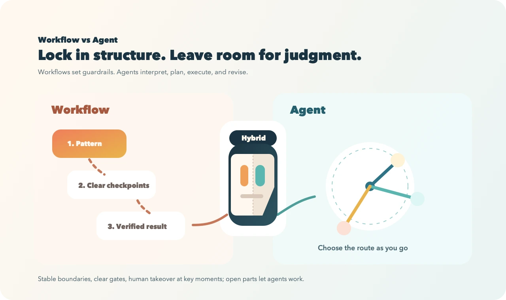

# Agent Skill：把一次性提示词，变成可复用的能力模块

很多人第一次接触 agent，都会先让它做一件看起来很轻松的事，比如“给这篇 blog 生成一张封面图”。

我最近就踩过一个很典型的坑。

第一版图片，是 AI 直接根据我口述的提示词生成的。第二版和第三版，则是我继续修正 prompt 之后重新生成的。三轮下来，图都不算丑，但始终不能让我满意。直到最后我切换了方法，用了一个专门的**美学 skill** 去生成，效果才立竿见影。

这也是我现在最想强调的一点：很多时候问题不在于“prompt 还不够长”，而在于**任务已经不该继续靠手工调 prompt 解决了**。

## 先看最直观的区别：不用 skill，和用 skill 做 blog 图

如果不用 skill，通常的做法就是不断改 prompt。

一开始我也是这么做的，路径大概是这样的：

- 第一版：AI 直接根据我口述的提示词生成
- 第二版：我开始修 prompt，希望画面更简洁、更聚焦
- 第三版：继续补充风格和文字，希望它更像一张正式封面
- 第四版：不再继续手调 prompt，改用美学 skill 生成

下面这张四宫格，就是这四次尝试的完整对比：


如果只看结果，其实问题会更清楚：

- 第一版有一点气质，但更像一个抽象符号，和文章主题的关系很弱
- 第二版虽然更干净，却还是停留在“抽象图形”层面
- 第三版继续调 prompt 后，风格更柔和，还加了标题，但仍然没有真正进入文章语义
- 第四版换成美学 skill 后，画面开始同时满足主题、产品感和 blog 封面的使用场景

也就是说，这不是“从一个差结果直接跳到一个好结果”，而是**前面三次 prompt 微调都没有解决核心问题，最后通过 skill 换了工作方式，才真正收敛**。

只靠 prompt 的时候，常见的问题是：

- 没有先读文章标题、摘要和受众
- 不知道要遵循什么品牌风格和版式约束
- 不会主动生成多个候选方案再筛选
- 输出文件命名、保存路径、后续发布流程都不统一

而当我把这件事做成一个专门的 skill 之后，agent 的工作方式就变了。它不再只是“听一句话，然后自由发挥”，而是会先进入一条已经验证过的流程：

1. 先读取文章标题、摘要、关键词和目标读者
2. 再读取参考风格、已有封面和输出目录
3. 按约定好的步骤生成多个候选图
4. 根据使用场景保留合适的风格方向
5. 用统一命名落盘，方便后续发布和复用

下面这张图，更接近我理解的差异本质：**skill 不是把 agent 变成死板流程，而是给它一个可靠的工作框架，让自由发挥落在正确边界内。**



回到封面图这件小事上，差异可以概括成下面这张表：

| 维度 | 不用 skill | 用 skill |
| --- | --- | --- |
| 输入 | 一句临时 prompt | 标题、摘要、受众、风格参考、输出约束 |
| 过程 | 一次性生成 | 分步读取上下文，多轮出候选，按规则筛选 |
| 输出 | 单张结果，靠运气 | 多个稳定变体，可追溯、可复用 |
| 复用方式 | 复制粘贴 prompt | 团队共享同一套 workflow |
| 质量控制 | 靠个人经验 | 靠脚本、约束和检查清单 |

对我来说，这个例子最有价值的地方，不是“最后那张更好看”，而是它说明了：**当任务已经涉及审美判断、主题理解和版式用途时，继续手调 prompt 的收益会越来越低；把经验写成 skill，才会出现质变。**

## 什么是 agent skill

如果只用一句话解释，我会说：

> **Skill 是给 agent 的可复用工作说明书。**

它不是模型参数，也不是神秘 prompt，而是一个模块化目录，通常至少包含一个 `SKILL.md`。这个文件负责告诉 agent：

- 什么时候该触发这个 skill
- 这个任务应该按什么步骤做
- 哪些脚本可以直接运行
- 哪些参考资料要按需读取
- 输出应该长什么样

一个常见的 skill 目录大致长这样：

```text
my-skill/
├── SKILL.md
├── scripts/
├── references/
└── assets/
```

其中：

- `SKILL.md` 负责定义入口、触发条件和核心流程
- `scripts/` 放确定性更强、值得复用的脚本
- `references/` 放按需加载的说明文档和领域知识
- `assets/` 放模板、图片、示例文件等输出资源

这背后有一个很重要的设计原则，叫 **progressive disclosure**。也就是说，agent 先只看到 skill 的元信息；真正触发后再读取 `SKILL.md`；只有需要时才继续读取 `references/` 或运行 `scripts/`。

这种结构设计的好处非常直接：

- 可以按任务阶段渐进式披露信息，而不是一开始把所有内容都塞进上下文
- 更容易管理上下文，减少噪音，节省 token
- 让 LLM 在正确时机拿到正确材料，因此整体表现会显得更聪明

很多人以为让模型“更聪明”的办法，是给它塞更多说明。但 skill 的经验恰恰说明，**不是给得越多越好，而是给得越准、越分层越好**。

从放置位置看，skill 通常有两类：

- **项目级 skill**：跟着仓库走，放在项目里，适合绑定业务工作流
- **系统级 skill**：装到用户自己的 skill 目录里，适合跨项目复用

## 为什么要用 skill

我现在越来越把 skill 理解成一种“经验固化器”。

不用 skill 的时候，每次都像在重新带一个聪明但失忆的同事开工：要重新解释背景、重新讲步骤、重新强调边界。用了 skill 之后，这些重复劳动就被沉淀了下来。

我用 skill，主要是因为它同时解决了五个问题：

### 1. 把重复解释变成一次沉淀

如果一件事要反复做，比如转字幕、出文档、剪视频、合 PR、发 blog，那么每次重新描述流程都是浪费。skill 的价值，就是把这些高频说明变成稳定入口。

### 2. 把经验变成流程，而不是留在脑子里

很多高质量结果，并不是靠“更有灵感的 prompt”，而是靠顺序正确的步骤。先读什么，后做什么，失败时怎么回退，产物怎么检查，这些都更适合写进 skill。

### 3. 把工具调用标准化

很多任务一旦牵涉 `ffmpeg`、Whisper、GitHub CLI、MCP、Playwright、GCS、数据库或者浏览器自动化，就已经不是一句提示词能稳定完成的事情了。skill 可以把这些工具的调用顺序、参数约定和前置检查封装起来。

### 4. 把安全边界写清楚

像 `auto-dev` 这种工程类 skill，真正重要的并不是“让 agent 自主开发”，而是明确告诉它：

- 不要默认操作 `main` 和 `dev`
- 只在当前 worktree 内工作
- 不要跨分支 push
- 不要改写远程历史

这些不是锦上添花，而是 agent 真正能进入生产流程的前提。

### 5. 把个人效率升级成团队资产

一个好的 skill，不应该只服务某一个人。它应该能被同事复用，能被新项目迁移，能随着使用不断被打磨。这样积累下来的不是“几段 prompt”，而是一套越来越成熟的组织能力。

## 如何使用 skill

从用户视角，skill 的使用方式其实很简单。

### 1. 直接点名触发

最直接的方式，就是在请求里明确说出 skill 名字，比如：

```text
/subtitle video/demo.mp4
/smart-cut video/demo.mp4 30%
/video2doc video/talk.mp4
go auto-dev
```

### 2. 按意图触发

很多时候你不用记住名字。只要你的意图足够明确，agent 也可以根据 skill 的描述自动判断该不该触发，比如：

- “把这个中文讲解视频转成英文配音版”
- “把这份 PPT 整理成一篇文章”
- “帮我发布一篇 TaleLens blog”

### 3. 触发后按需展开

真正好用的 skill，不会一开始就把所有说明塞满上下文，而是分层展开：

- 先读 `SKILL.md`
- 需要时再读 `references/`
- 能脚本化的部分直接跑 `scripts/`

这也是为什么 skill 比“超长 prompt 模板”更稳。prompt 只能一次性灌进去；skill 则可以按任务进展逐层取用。

## 如何制作 skill

我自己的经验是：**不要从“我要做一个 skill”开始，而要从“我是不是在重复做同一件事”开始。**

一个值得做成 skill 的任务，通常符合下面几个特征：

- 经常重复出现
- 包含多步流程
- 要调用外部工具或脚本
- 需要固定的输出格式
- 容易因为漏步骤而翻车

制作 skill 时，我一般按这个顺序来：

### 1. 先定义触发条件

`SKILL.md` 里的 `name` 和 `description` 非常重要。它们直接决定 agent 能不能在正确场景下触发 skill。描述要讲清楚“何时用”，而不只是“它叫什么”。

### 2. 把核心流程写短、写清楚

`SKILL.md` 不需要写成长篇文档。只保留 agent 真的不知道、但任务又离不开的信息。越简洁，越容易被正确执行。

### 3. 把确定性强的部分移到脚本

比如文件转换、路径处理、发布检查、上传逻辑、格式校验，这些都更适合进 `scripts/`。一旦你发现 agent 老是在重写同一段命令，说明这部分已经值得脚本化。

### 4. 把细节资料移到 references

如果某个 skill 支持很多变体，不要把所有内容都堆在 `SKILL.md`。把变体说明、接口文档、案例放到 `references/`，按需加载。

### 5. 用真实任务迭代

我不太相信“闭门造车式”写 skill。最好用真实任务去跑它，看看 agent 会不会误触发、会不会漏关键步骤、会不会在边界条件下出错。skill 真正的版本升级，不是在文档里完成的，而是在使用中完成的。

## 如何发布和管理 skill

很多人会问，skill 做完以后怎么分享、怎么维护？

我现在比较认可的是分层管理：

### 1. 先在项目内沉淀

如果 skill 强依赖当前仓库的结构、脚本和业务逻辑，那就先做成**项目级 skill**。这种方式最实用，也最容易随着项目一起演化。

### 2. 再抽成全局通用能力

当一个 skill 已经在多个项目里都能用，就可以放到用户级目录，比如 `~/.codex/skills`，或者整理进统一仓库。像 `auto-dev` 这种偏通用的工程 skill，就适合做成“核心 skill + 项目扩展包”的模式，把通用部分和业务特例分开。

### 3. 以 `skills-hub` 这种用户级仓库来发布

我自己现在最常用的**非项目级** skills，不是零散放在本机里，而是统一放在一个用户级仓库里：

`https://github.com/xiaojiongqian/skills-hub`

这种方式的好处是，它不绑定某一个业务项目，而是把我经常跨项目复用的技能统一管理起来。对外发布时，也不是“手工拷贝几个文件夹”，而是把整个仓库当成 skill 分发源。

它的原理其实并不复杂：

```text
GitHub skills 仓库
-> skills CLI 拉取仓库内容
-> 识别其中符合约定的 skill 目录和 SKILL.md
-> 安装到用户级 skill 目录
-> agent 在后续任务里按需发现和触发
```

也就是说，仓库负责做**版本管理和分发**，`skills` CLI 负责做**安装和配置**，而 agent 运行时则根据 `SKILL.md` 的元信息去决定何时使用它。

以 `skills-hub` 这种发布方式来说，它有几个很实际的优点：

- 适合放跨项目都能复用的通用 skill
- 可以统一迭代、统一升级，而不是每个项目各维护一份
- 新机器或新同事接入时，安装路径更简单
- 可以按仓库整体安装，也可以按单个 skill 精选安装

按当前公开 README 和 `skills` CLI 文档的写法，更推荐直接用 `add` 命令安装：

```bash
npx skills add xiaojiongqian/skills-hub
```

如果想先看仓库里有哪些可装的 skill，可以先列出来：

```bash
npx skills add xiaojiongqian/skills-hub --list
```

如果你只想装某一个，而不是整仓全部装下来，也可以指定：

```bash
npx skills add xiaojiongqian/skills-hub --skill auto-dev
```

装完以后，比较常见的维护动作还有：

```bash
npx skills check
npx skills update
```

对我来说，这种模式的意义很大。因为它让“我的常用 skill 集合”从几段散落在不同项目里的说明，变成了一个真正可以分发、升级、迁移和复用的用户级产品。

### 4. 通过仓库或 skills 生态发布

发布方式并不神秘，本质上就是 Git 仓库分发：

- 放进团队自己的 `skills-hub`
- 放到 GitHub 仓库供别人安装
- 用 skills CLI 做发现和安装

如果是开放生态里的 skill，安装方式通常类似：

```bash
npx skills find <query>
npx skills add <owner/repo@skill>
```

而如果是团队内部技能，更常见的做法是直接通过仓库脚本链接到本地环境。

### 5. 技能市场现在长什么样

如果把视野放大一点，现在所谓的“skills 市场”其实还处在比较早期的阶段，主流形态并不是传统意义上的应用商店，而更像是：

- 一个公开目录
- 一组 GitHub 仓库
- 再加上一些团队自己的私有 skill 仓库

我觉得现在最值得看的几个入口是：

- `skills.sh`：这是 `skills` 生态里最像公开市场的目录站，可以搜索、浏览和查看安装方式
- GitHub 上的公开 skill 仓库：比如 `openai/skills`、一些团队自己的 skills repo，以及像 `skills-hub` 这样的个人技能仓库
- 团队内部私有仓库：很多真正高价值的 skill，最后都会落在公司或个人维护的私有 hub 里，因为里面往往带着业务流程、脚本和权限约束

所以从分发模式上看，今天的 skill 市场更像“GitHub + 目录发现 + CLI 安装”的组合，而不是一个完全中心化的平台。

### 6. 安装其它 skill 时，安全问题一定要想在前面

这一点我想单独强调，因为很多人会误以为 skill 只是“多一段 prompt”。

其实不是。

一个 skill 里可能包含：

- `SKILL.md` 里的操作指令
- 可直接运行的脚本
- 对数据库、云服务、浏览器、Git、MCP 的调用方法
- 对本地环境和认证状态的依赖

所以安装第三方 skill，本质上是在给 agent 新的执行能力。真正要担心的，不是它“写得够不够聪明”，而是它**会不会在你没意识到的地方拥有过大权限**。

我自己的安全习惯大致是这样：

1. 先看来源，再决定装不装。
2. 先读 `SKILL.md`，再看 `scripts/`，不要盲装。
3. 第一次使用尽量先在非生产环境、测试仓库或隔离 worktree 里试。
4. 涉及 `git push`、云资源、数据库、浏览器自动化、MCP 配置、认证信息的 skill，要格外谨慎。
5. 不要默认把新装的 skill 直接接入生产凭证和高权限环境。
6. 如果团队要长期使用，最好 fork 一份或维护自己的镜像，而不是把信任完全交给上游仓库。

我尤其会警惕下面这些信号：

- 安装后会自动改 agent 配置，但你不知道改了什么
- skill 自带大量 shell 脚本，却没有说明边界
- 涉及 `gh`、`gcloud`、`firebase`、`ssh`、数据库或对象存储访问
- 默认就鼓励在 `main`、`dev` 或生产环境里直接操作
- 需要长期保存 token、cookie 或管理员密码

说白了，**安装第三方 skill 的安全问题，和安装第三方自动化脚本、本地 agent 插件、本地 MCP 服务，本质上是同一类问题。**

好消息是，skill 的结构通常比黑盒插件更透明。只要你养成先读 `SKILL.md` 和脚本、先小范围试用、再逐步放权的习惯，风险是可以管住的。

### 7. 用 Git 管理版本，而不是靠口口相传

skill 一旦开始被多人使用，就应该像代码一样管理：

- 改动走 Git
- 命名保持稳定
- 升级要可追溯
- 过时 skill 要清理
- 元信息和真实行为要保持一致

另外，工程类 skill 一定要把**权限、环境、密钥、分支安全**这些问题想在前面，而不是出了事故再补文档。

## 我现在常用的几个 skill / skill 仓库，以及它们带来的实际效果

对我来说，skill 的价值从来不在“列表很多”，而在于每一个都能把一个具体任务链路压缩掉。

### 1. `skills-hub`

这是我现在最常用的用户级 skill 仓库。它更像一个“技能分发包”，而不是单一技能。

更准确地说，`skills-hub` 既是我的**用户级安装入口**，也是我日常常用的一组通用 skills 的集合。也就是说，我常用的不只是这个仓库本身，而是它里面那批已经沉淀好的技能。

按当前仓库公开的结构，里面包含 `auto-dev`、`chrome-mcp-remote`、`design-eye`、`eng-lead`、`firebase-gcp-debug`、`gh-address-comments`、`gh-fix-ci`、`git-pr-merge`、`git-sync-dev-submodules`、`jina-web-fetch`、`patent-search-cn-us`、`playwright-mcp`、`system-architect`、`test-philosophy` 等 skills。

效果是：

- 跨项目复用的 skill 可以统一安装和维护
- 新环境迁移时，不需要重新手工拷贝 skill
- 常用工程类和运营类能力可以做成自己的长期资产

如果再往里拆，我比较常用的大致有几类：

- 开发执行类：`auto-dev`、`git-sync-dev-submodules`
- 审查与合并类：`git-pr-merge`、`gh-fix-ci`、`gh-address-comments`
- 架构与质量类：`system-architect`、`test-philosophy`、`eng-lead`
- 调试与外部系统类：`firebase-gcp-debug`、`playwright-mcp`、`jina-web-fetch`

这一层很重要，因为它说明 `skills-hub` 对我不是“一个安装命令”，而是一套真正长期在工作的用户级能力底座。

### 2. `subtitle`

作用很基础，但非常关键：把视频提取音频并生成同名 `SRT` 字幕。

效果是：

- 视频先被结构化成时间轴文本
- 后续 `smart-cut`、`video2doc`、`dub-en` 都能直接接上
- 原本“先转录再整理”的手工步骤被消掉

### 3. `smart-cut`

这是一个很典型的 workflow skill。它不是简单加速视频，而是先分析字幕，再优先去掉空白、语气词、重复内容，必要时再做轻度加速。

效果是：

- 得到更短但信息密度更高的成片
- 同时保住字幕同步
- 顺手提炼出主要观点，方便后续写文案或摘要

### 4. `video2doc`

这个 skill 把“看完一段长视频再写总结”的过程，变成了结构化输出：读字幕、提取全文上下文、筛选关键画面、生成图文 Markdown。

效果是：

- 视频能快速转成一篇可发布的文章
- 配图不是乱插，而是和段落内容匹配
- 内容生产从“看完再写”变成“边抽取边生成”

### 5. `dub-en`

这类 skill 的价值，在于它不只是“翻译字幕”，而是尽量保持说话节奏和原始音色，把中文讲解视频转成英文配音版本。

效果是：

- 直接产出英文版视频和英文字幕
- 更适合做跨语种传播
- 原视频内容的复用价值显著提高

### 6. `slide2doc`

PPT、PPTX 和 PDF 经常信息密度很高，但不适合直接阅读。这个 skill 把“逐页看幻灯片”改造成“自动生成有叙事结构的 Markdown 文章”。

效果是：

- 汇报材料更容易二次传播
- 演讲稿和分享会内容能更快沉淀成文档
- 不需要手工一页一页翻译 slide

### 7. `talelens-blog-admin`

这类 skill 是典型的 MCP + 业务规则结合。它不只是“帮我发 blog”，而是把环境切换、鉴权、封面图格式、正文图片公网地址、更新和删除流程都规范下来。

效果是：

- blog 发布不再依赖人工记忆操作步骤
- dev / prod 环境切换更安全
- 图片和 SEO 约束能在发布前暴露出来

### 8. `auto-dev`

这是我非常看重的一类 skill，因为它说明 skill 不只是做内容生产，也可以做工程治理。

效果是：

- agent 能在当前 worktree 里长期自主开发和调试
- Git 安全边界被提前写死
- 浏览器自动化、测试、云端检查这些动作可以被统一调度

对团队来说，这种 skill 的意义远大于“省一点时间”。它是在把工程纪律从个人习惯，变成系统约束。

## 结语

我越来越觉得，skill 真正解决的问题，不是“怎么让 agent 更像专家”，而是：

> **怎么把已经验证过的流程、约束和经验，变成 agent 每次都能重新执行的能力。**

不用 skill 的 agent，当然也能工作，但很多能力是一次性的、不可复用的、不可继承的。用了 skill 之后，agent 的聪明才开始沉淀为资产。

所以从封面图、字幕、视频文档，到 blog 发布、PR 合并、自动化开发，我现在基本都会反过来想一个问题：

**这件事，是不是已经值得做成一个 skill 了？**

因为当你开始这样思考，得到的就不再只是几个好结果，而是一套能够不断复利的工作系统。

---

*写于 2026 年 3 月*
