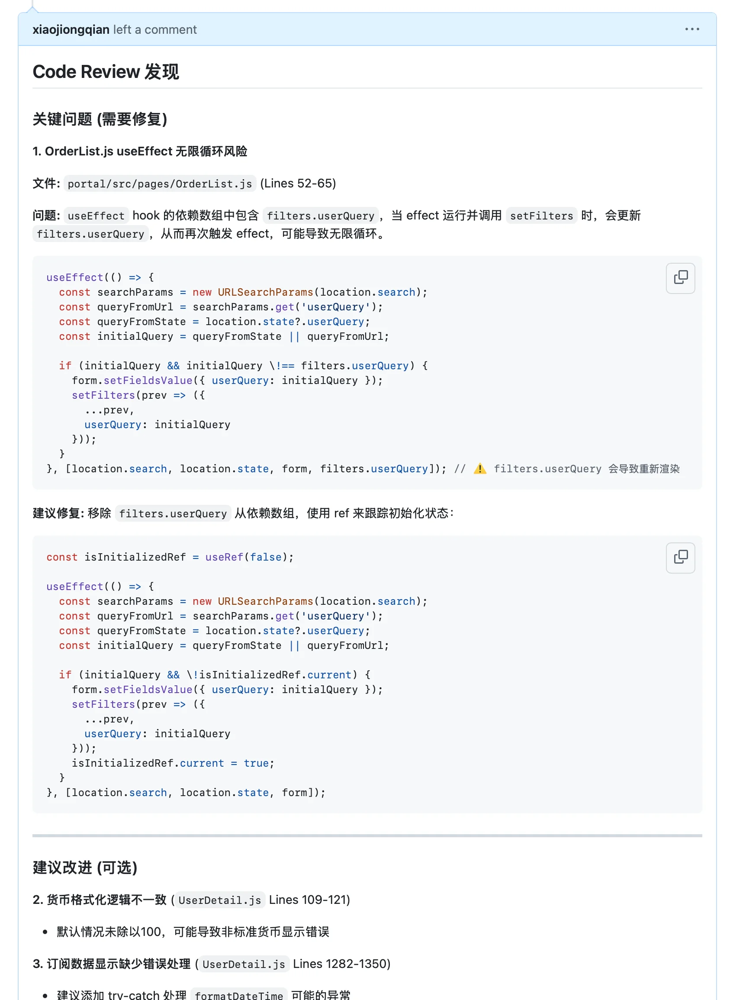
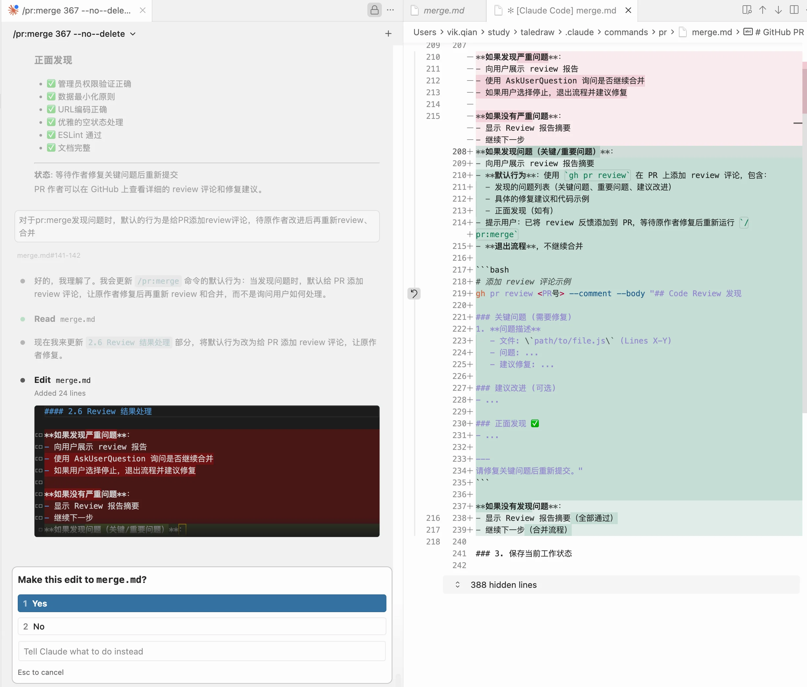

# /pr:merge — 用一条命令，重建团队的代码质量底线

> 表面上，它是一个 PR 自动合并工具。实际上，它是一道质量门禁——挡住不该进主干的代码，同时倒逼团队走向 AI-Native 开发。

## 问题不在合并，在合并时没人把关

团队协作中，合并一个 PR 看似简单，实际上你要做的事远比点一下"Merge"按钮多得多：

- 打开 PR，逐行看 diff，脑子里盘算有没有安全隐患
- 切到目标分支，pull 最新代码，手动 merge，解决冲突
- 跑一遍 lint，跑一遍测试，祈祷别挂
- 推送、关 PR、删分支、切回自己的工作分支
- 如果中间有一步出了问题，还得回滚、重来

一个中等规模的 PR，这套流程走下来 **20-40 分钟**轻轻松松。如果一天要合 3-5 个 PR，光合并就占掉半天。

但真正的问题不是慢——**是该做的检查被跳过了**。赶进度的时候，谁还记得看有没有配套的单元测试？谁还会检查新特性有没有附带设计文档？代码就这样带着隐患进了主干，直到某天在线上爆发。

## 一条命令，完成从审查到合并的全流程

`/pr:merge` 是一个运行在 Claude Code 中的自动化 PR 合并命令。你只需要给它一个 PR 编号：

```
/pr:merge 123
```

就这一行。接下来它会：

1. **拉取 PR 信息** — 检查状态、CI 结果、是否可合并
2. **自动 Code Review** — 检查代码质量、安全隐患、逻辑错误
3. **PR 完整性审核** — 新特性 PR 是否附带了设计文档？单元测试覆盖了多少？
4. **智能冲突解决** — 简单冲突（import 合并、格式差异）自动处理，复杂冲突反馈到 PR 评论
5. **运行测试** — 根据改动模块自动跑对应的 lint 和单元测试
6. **合并推送** — 提交、推送、关闭 PR、删除分支
7. **生成报告** — 输出完整的合并报告，包含 review 结果、冲突处理、测试情况

全程自动执行，不会弹出"是否继续？"打断你的心流。

## 不只是"自动合并"，而是一套质量防线

很多自动合并工具只管合，不管质量。`/pr:merge` 不一样——**它是一个带审核能力的合并流程，合并只是审查通过后的自然结果**。

### 分级 Review：小改动快速过，大改动严格审

根据 PR 大小自动调整审核力度：

| PR 规模 | 审核内容 |
|---------|---------|
| 小型（< 100 行） | 基础代码检查 + 安全扫描 |
| 中型（100-500 行） | 基础检查 + 完整性审核 + code-reviewer agent 深度审查 |
| 大型（> 500 行） | 全部检查 + [code-simplifier](https://docs.anthropic.com/en/docs/claude-code/skills) agent 简化建议 |

其中 code-simplifier 是 Claude Code 官方提供的内置 skill plugin，专注于识别可简化的复杂逻辑并给出重构建议。`/pr:merge` 在大型 PR 审查时会自动调用它，无需额外安装。

### 新特性门禁：没有测试和文档，就不该进主干

对于 `feat/`、`feature/` 等新增特性分支，会额外检查：

- **有没有需求/设计文档？** 检查 PR 中是否包含文档文件，或 PR 描述中是否有充分的设计说明
- **有没有单元测试？** 提取新增的公开接口，逐一检查是否有对应的测试用例
- **测试覆盖够不够？** 计算覆盖率，不足时给出具体建议（"请为 `calculateTotal` 添加单元测试"）

缺少测试的新特性 PR 会被拦截，反馈直接写到 PR 评论里，作者一眼就能看到该补什么。

### 发现问题就停下来，而不是带病上线

如果 review 发现关键问题——安全漏洞、逻辑错误、缺少测试——不会硬着头皮合进去。它会：

1. 把具体问题通过 `gh pr review` 写到 PR 评论
2. 终止合并流程
3. 告诉你哪里有问题、怎么修

等作者修好了，再跑一次 `/pr:merge` 就行。

下图是 review 未通过时，工具自动写到 PR 评论中的反馈——问题定位到具体文件和行号，附带修复建议，作者打开 PR 就能直接对照修改：



## 怎么用

### 基本用法

```bash
# 合并 PR #123 到 dev 分支（默认），合并后删除源分支
/pr:merge 123

# 合并到指定分支
/pr:merge 123 --target main

# 保留源分支不删除
/pr:merge 123 --no-delete

# 用 worktree 模式，不影响当前工作区
/pr:merge 123 --worktree
```

### 参数一览

| 参数 | 必填 | 说明 |
|-----|------|------|
| `PR号` | 是 | GitHub PR 编号，如 `123` 或 `#123` |
| `--target <分支>` | 否 | 目标分支，默认 `dev` |
| `--no-delete` | 否 | 保留源分支 |
| `--worktree` | 否 | 在临时 worktree 中操作，不影响当前工作区 |

## 开源地址与安装

本工具是 [skills-hub](https://github.com/xiaojiongqian/skills-hub) 开源项目的一部分。skills-hub 是一个通用的 AI 编程技能仓库，采用"核心技能 + 项目扩展包"的架构，让技能可以跨项目复用。

### 前置条件

- [Claude Code](https://docs.anthropic.com/en/docs/claude-code) CLI 已安装并可用
- [GitHub CLI](https://cli.github.com/)（`gh`）已安装并完成认证（`gh auth login`）
- 对目标仓库有写入权限和推送权限
- Node.js 环境（用于运行 lint/test，视项目而定）

### 安装步骤

有两种方式可以完成安装：

**方式一：运行链接脚本（推荐）**

```bash
# 1. 克隆仓库
git clone https://github.com/xiaojiongqian/skills-hub.git ~/skills-hub

# 2. 运行链接脚本，将技能注册到本地 Claude Code
cd ~/skills-hub
bash scripts/link-local.sh

# 3. 在任意 GitHub 项目中使用
cd /path/to/your-project
# 直接在 Claude Code 中输入：
/pr:merge 123
```

**方式二：让 AI Agent 帮你装**

如果你不想手动跑脚本，也可以把 skills-hub 工程目录直接丢给 code agent（Claude Code、Codex CLI 等），告诉它"帮我把这些 skill 安装到本地"。Agent 会自动理解项目结构并完成链接配置。这种方式特别适合不熟悉 shell 脚本的同学，或者你想让 agent 顺便根据你的项目情况做一些定制调整。

### 适用范围

`/pr:merge` 几乎适用于所有需要严格质量管理的严肃开发场景：

- 任何使用 GitHub 托管的项目，不绑定特定语言或框架
- 日常的功能分支合并、bugfix 合并、依赖更新合并
- 团队协作中需要标准化合并流程的场景
- **具有历史包袱的老项目**同样适用——agent 具备高度智能，能够理解项目的实际代码结构、技术栈和工程规范，动态适配审查策略。你甚至可以让 agent 根据你的项目特点对 skill 本身做出定制和优化，比如调整 review 规则、增加项目特有的检查项、适配非标准的测试框架等

下图是一个真实场景：在使用 `/pr:merge` 合并 PR 的过程中，发现了流程中可以改进的地方，随即让 agent 对 skill 本身进行定制优化——这正是 AI-Native 工作方式的体现，工具在使用中被持续打磨：



简单来说，只要你的项目托管在 GitHub 上、你希望合并流程有质量保障，它就能帮上忙。

## 引入后会发生什么——一次必要的质量阵痛

坦率地说，刚开始用 `/pr:merge` 的时候，你会明显感觉到一个变化：**PR 合并的成功率大幅下降了**。

以前随手就能合进去的代码，现在被拦下来了——缺单元测试、没有设计文档、代码有安全隐患、逻辑有潜在 bug。这些问题以前不是不存在，只是没人检查，或者赶进度的时候睁一只眼闭一只眼。

这不是效率降低了，恰恰相反——**这是质量管理体系在升级**。

从粗放式的"能跑就行"，切换到有标准、有门禁、有反馈的工程化流程，团队需要一个适应期。开发者需要习惯：提交新特性时附带测试，PR 描述里写清楚设计思路，代码在提交前就通过基本的质量检查。

但当团队跑顺之后，变化是显著的：

- 主干分支的代码质量持续提升，线上问题减少
- 每个 PR 都有完整的 review 记录，可追溯、可复盘
- 新人接手项目时，通过 PR 历史就能理解设计决策

## 真正的意义：从工具到转型催化剂

`/pr:merge` 还会带来一个意想不到的连锁效应——**它会自然地推动整个团队采用 code agent 进行开发**。

原因很简单：当合并流程有了严格的质量门禁，手动写代码的开发者会发现，自己的 PR 频繁被打回——缺测试、缺文档、代码风格不符合规范。而使用 code agent（Claude Code、Codex 等）的开发者，agent 会在编码过程中就自动补全测试、生成文档、遵循项目规范，PR 提交后一次通过的概率高得多。

这个效率差距会迅速显现。不用 agent 的人，光是反复修改被打回的 PR 就要花大量时间；用 agent 的人，代码从一开始就是高质量的，合并流程一路绿灯。

**当"用 agent 开发"从可选变成了效率上的必然选择，团队就自然而然地完成了向 AI-Native 开发模式的演进。**

所以 `/pr:merge` 不只是一个合并工具。它是质量门禁，是流程规范，也是推动团队开发模式升级的催化剂。一条命令背后，是从"人治"到"机制"的转变——让质量不再依赖个人自觉，而是成为流程本身的一部分。
