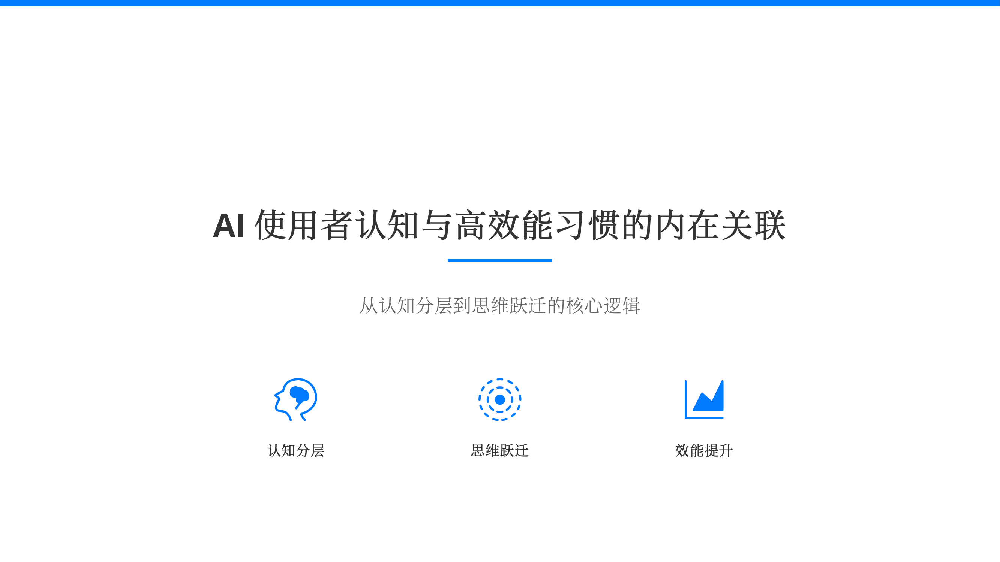
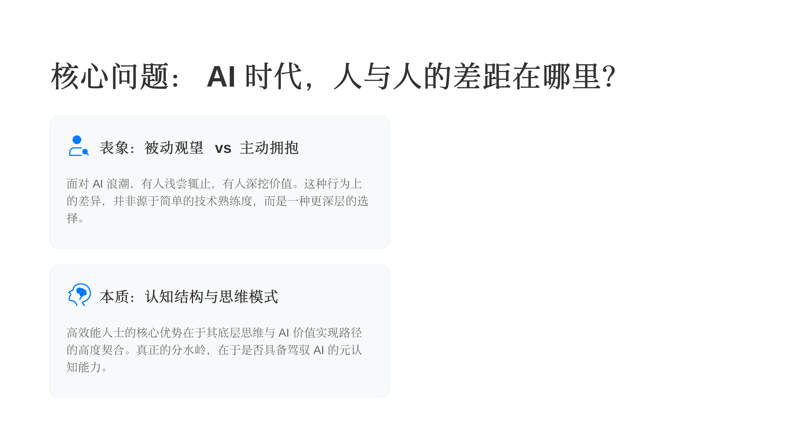
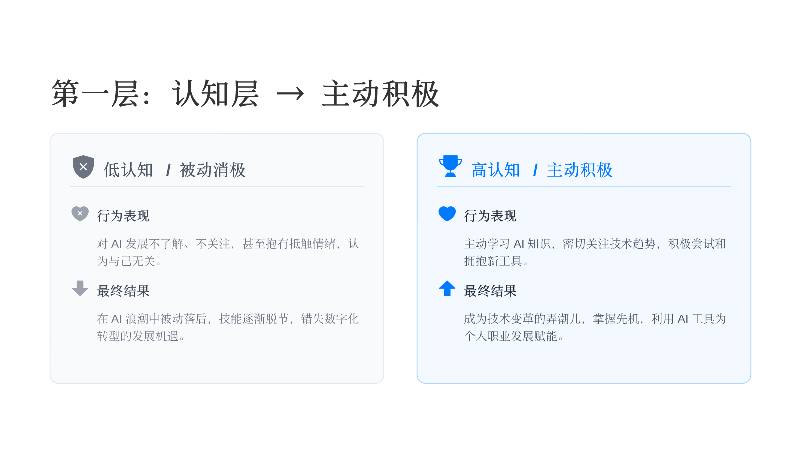
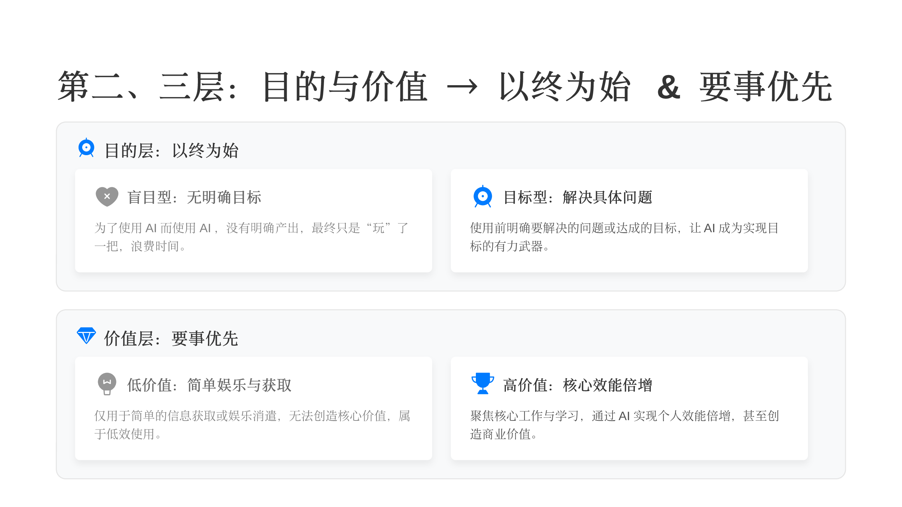
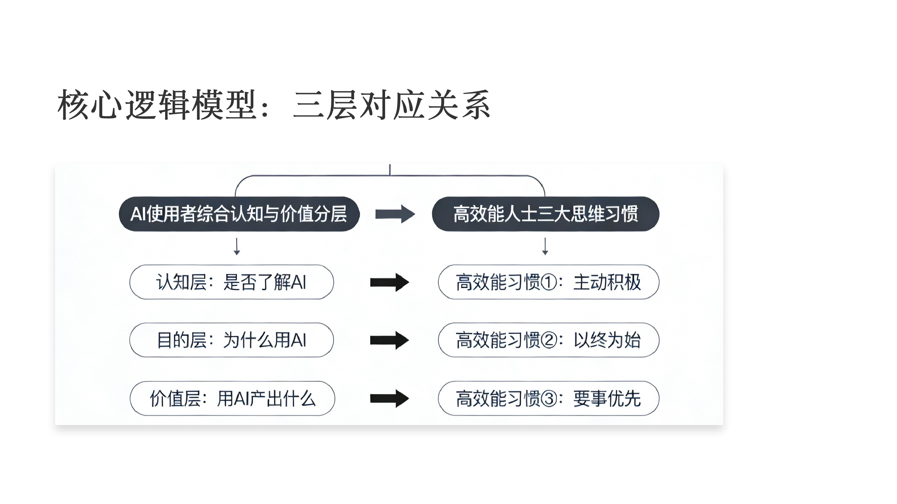
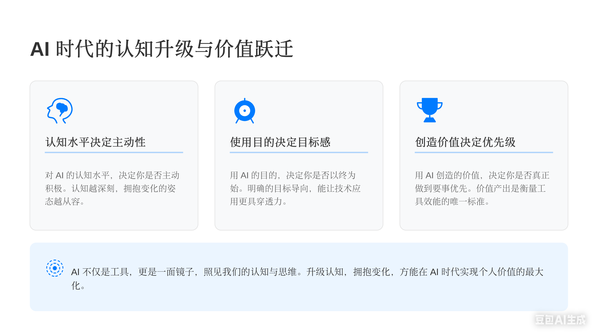

# AI 使用者认知与高效能习惯的对应关系

> 同样是用 AI，为什么有人赚到了钱，有人只是玩了个寂寞？答案藏在你的认知和思维习惯里。

## 一、AI 时代，人和人的差距越来越大

AI 浪潮来了，但每个人的反应完全不同：

- 有些人压根没感觉，甚至都不会去接触 AI
- 有些人浅尝辄止，试了试就放下了
- 有些人玩得不亦乐乎，AI coding、生图样样来
- 还有一小部分人，已经靠 AI 获得了巨大的收益

这些差距看起来是"会不会用工具"的问题，但本质上，它反映的是**认知结构和思维模式**的差异。

## 二、一个逻辑模型：三层认知 × 三个习惯

视频提出了一个很有意思的对应关系——把 AI 使用者的认知分成三层，每一层恰好对应《高效能人士的七个习惯》中的一个核心习惯：

| 认知分层 | 核心问题 | 对应习惯 |
|---------|---------|---------|
| 认知层 | 是否了解 AI？ | 习惯一：主动积极 |
| 目的层 | 为什么用 AI？ | 习惯二：以终为始 |
| 价值层 | 用 AI 产出什么？ | 习惯三：要事优先 |

### 2.1 认知层 → 主动积极

第一层看的是你对 AI 的认知态度。

**低认知、被动消极的人**：对 AI 不了解、不关注，最终的结果就是错失数字化转型的机遇。

**高认知、主动积极的人**：密切关注技术趋势，自己动手尝试各种工具。结果呢？他们成为时代变革的弄潮儿，掌握先机，利用 AI 工具为职业发展赋能，甚至获得巨大成功。

说白了，主动积极的人不会等别人告诉他"该学 AI 了"，他自己就会去探索、去学习、去应用。

### 2.2 目的层 → 以终为始 & 2.3 价值层 → 要事优先

第二层看的是你用 AI 的目的，第三层看的是最终产出了什么价值。

很多人也在用 AI，用了一大堆工具，但没什么效果，生活还是老样子。为什么？因为没有明确目标。

甚至有些人做了很多 vibe coding，写了不少代码，但本质上还是"玩一玩"，没有真正解决什么问题。

而有目标感的人不一样——他聚焦于解决具体问题，有明确目标，让 AI 成为实现目标的有力武器。目前能做到这一点的人，可能还不到 1%。

低价值的使用方式：仅仅是娱乐和消遣，仅仅是去讨论、去关注——那是在你的**关注圈**，不在你的**影响圈**。

高效能人士的做法是要事优先：聚焦核心的工作和学习，通过 AI 实现很高的商业价值，核心能力得到倍增。

## 三、完整对应关系脑图

## 四、结论：AI 是一面镜子

AI 不仅仅是工具，更像一面镜子，照见我们的认知和思维。

一句话总结这三层对应关系：

> **对 AI 的认知水平，决定你是否主动积极；**
> **用 AI 的目的，决定你是否以终为始；**
> **用 AI 创造的价值，决定你是否真正做到要事优先。**

从提升认知、拥抱变化开始，最终达到 AI 时代的价值最大化。这三个习惯——主动积极、以终为始、要事优先——就这样和 AI 使用者的认知分层完美结合在了一起。

## 五、问题与思考

看完这些，不妨停下来问自己两个问题：

**你的目标是什么？**

你用 AI 是为了什么？是随便玩玩、跟风尝鲜，还是有一个清晰的目标在驱动你？学一门新技能、做一个产品、解决工作中的实际问题——哪怕目标很小，有目标和没目标，结果天差地别。如果现在还说不清楚，那可能就是"以终为始"这个习惯还没建立起来。

**你现在在做重要的事吗？**

刷了多少 AI 资讯、关注了多少大佬、收藏了多少教程——这些都是关注圈里的事。真正的问题是：你有没有把时间花在影响圈里？有没有在用 AI 做那件对你最重要的事？要事优先不是一个道理，是一个选择——每天都在做的选择。
