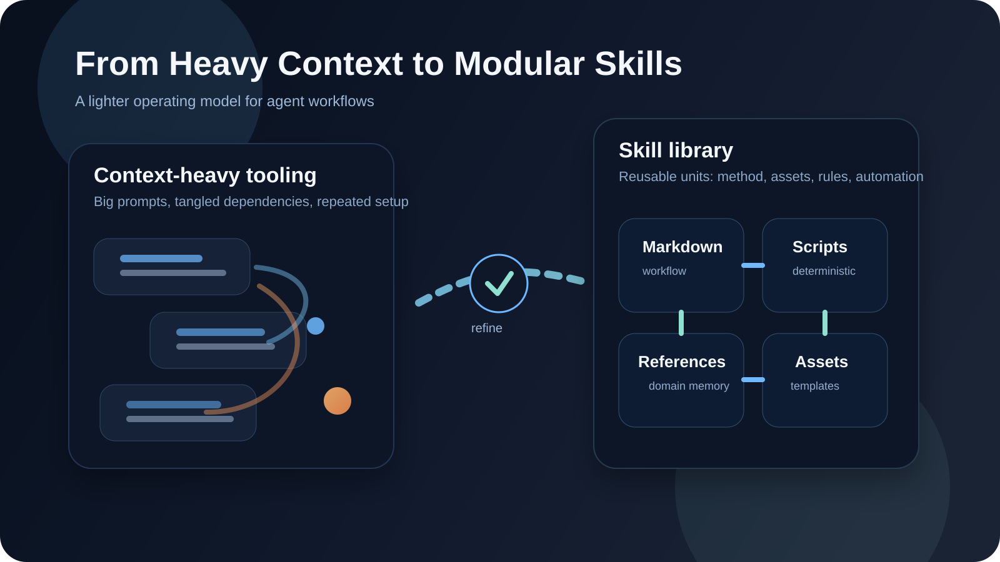
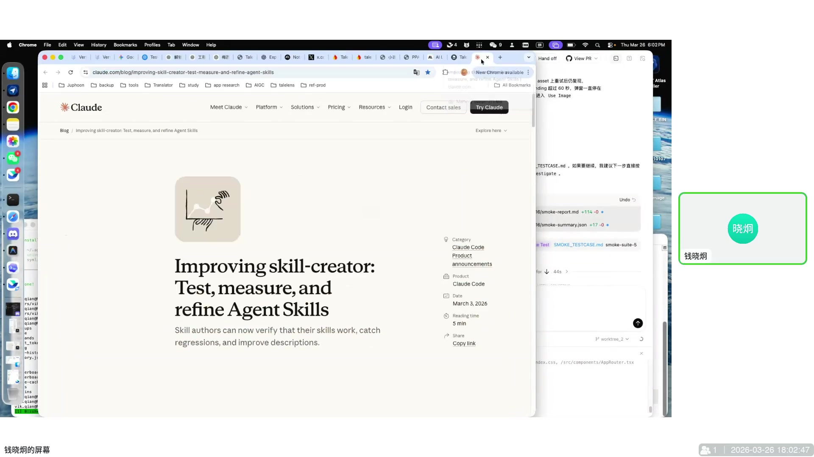
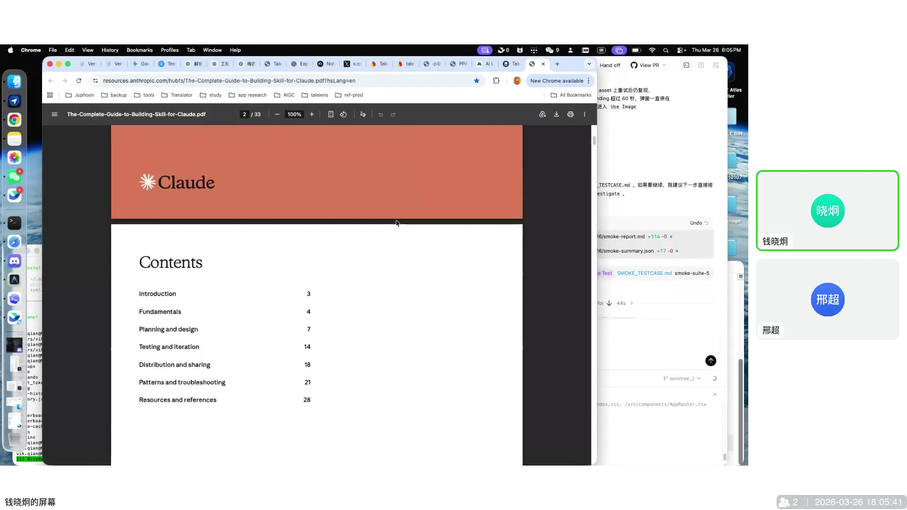
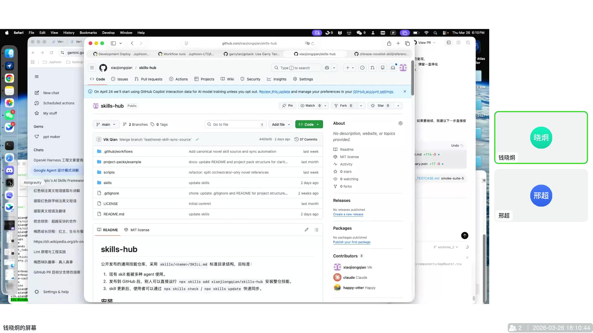
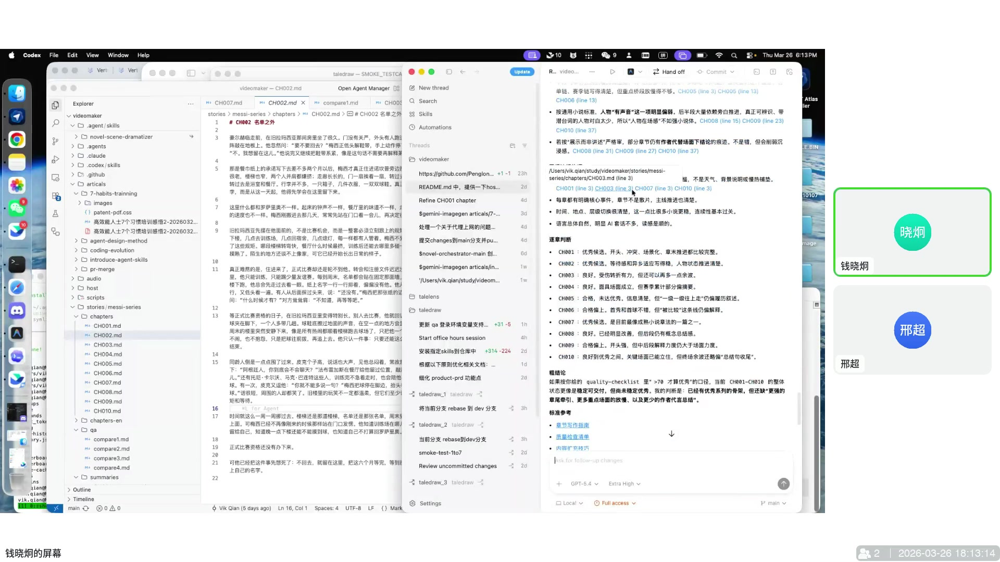
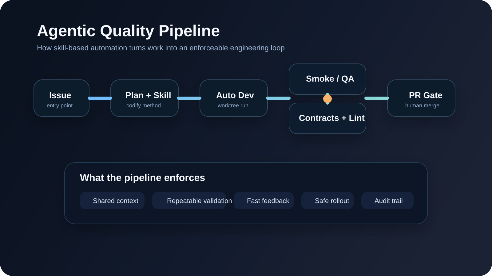
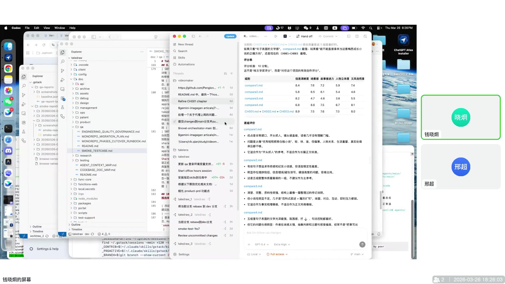
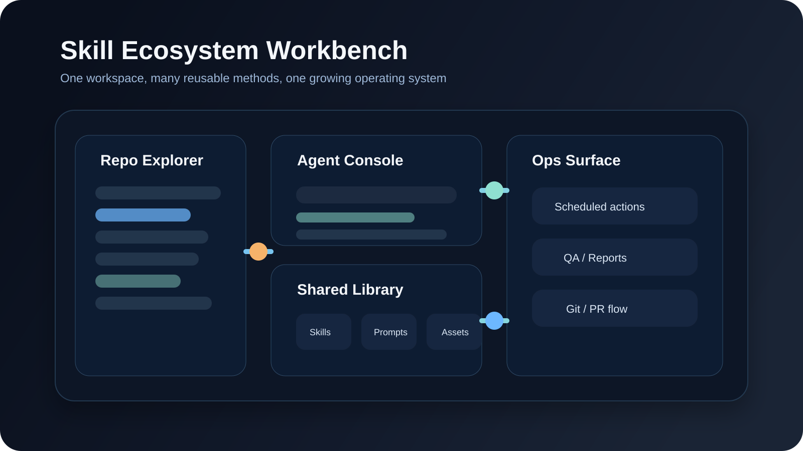
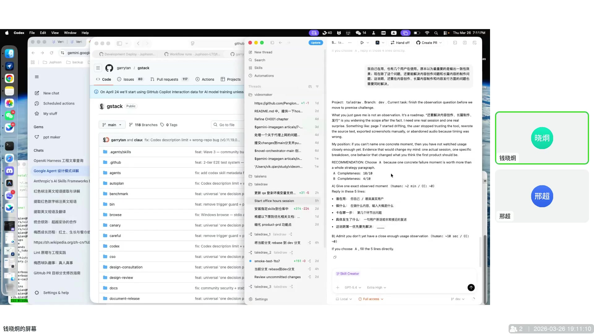

# 别再堆提示词了：Agent Skill 如何让 AI 真正进工作流

> 很多人以为 AI 不够好用，是模型还不够聪明。更常见的真相是：模型已经够强，真正缺的是一套能反复调用的方法。把方法、约束、脚本和资产沉淀成 `skill`，AI 才会从“偶尔帮上忙”变成“可以进入工作流”。



## 一、AI 真正卡住的地方，不是智商，而是没有工作方法

很多人用 AI 的第一阶段，都像在带一个记忆不太稳定的实习生。

要先解释背景，再补限制，再提醒风格，再补上一次没说清的前情。每次对话都像重新开机。偶尔会有惊艳时刻，但更多时候是：这次行，下次不一定还行。

问题往往不在模型，而在组织方式。

当工作仍然依赖临时发挥，AI 就只能做“聊天式协助”；当方法被拆成可调用的结构，AI 才开始拥有稳定手感。真正拉开差距的，不是多会写提示词，而是能不能把常用做法变成一套别人和机器都能直接复用的东西。

## 二、长上下文像搬家，Skill 像随身工具箱

早期大家都很迷恋一件事：把更多背景塞进上下文，最好一次讲透所有历史、规则和例外。看起来很保险，代价也很明显：上下文越来越重，调用越来越贵，复用越来越差。

`skill` 的优势恰恰相反，它强调“平时轻，必要时深”。

- 默认只暴露最小指令
- 需要时再展开脚本、参考资料和素材
- 同一套经验可以被重复调用，而不是反复口头重述

Anthropic 关于 Skill 的文章和手册，把这个思路讲得很清楚。





一个成熟的 skill，通常像这样：

```text
skill/
├── SKILL.md
├── scripts/
├── references/
└── assets/
```

它不是一个“高级提示词文件”，而是一段被压缩过的工作方法：

- `SKILL.md` 定义目标、边界和执行顺序
- `scripts/` 承担重复、机械、容易出错的动作
- `references/` 保存模型原本不知道的私有知识
- `assets/` 放模板、示意图、示例和样式材料

长上下文更像临时搬家，什么都往车上塞；skill 更像工具箱，需要什么拿什么，轻得多，也稳得多。

## 三、好 Skill 不是写出来的，是跑出来的

很多人第一次做 skill，最容易犯的错，不是写少了，而是写得太像说明书。

一份看起来很完整的文档，并不等于一个真正可用的 skill。没有经过反复执行、报错、回改和补洞的 skill，通常只是一份漂亮的 README。



真正能用的 skill 往往都有几个共同点：

- 任务边界清楚，知道自己该做什么、不该做什么
- 关键步骤可执行，而不是停留在描述层
- 有验证闭环，跑完以后知道结果是否可靠
- 能持续迭代，而不是第一次写完就封存

这也是为什么最值得做成 skill 的，往往不是通用常识，而是那些“模型不天然知道，但你团队反复要用”的东西：私有领域知识、固定流程、日志排查套路、PR 规范、测试策略、特定 Git 工作流。

这些内容一旦沉淀下来，就会从个人经验变成团队资产。

## 四、真正拉开差距的，不是单点能力，而是编排能力

很多人对 AI 的想象，仍然停留在“把一个任务交给它，然后等结果”。

这当然能工作，但一旦任务变复杂，问题就会立刻暴露：风格不稳、逻辑断裂、质量难查、错了也不知道错在哪。

更成熟的做法，是把复杂任务拆成多个边界清楚的角色，再让它们串起来工作。

- 一个 skill 负责总编排
- 一个 skill 负责局部润色
- 一个 skill 负责连续性检查
- 一个 skill 负责状态维护
- 一个 skill 负责最终验证



这一步非常关键，因为它把“大而模糊的自动化”变成了“小而可验的协作”。

AI 的价值不只是替代手工执行，更重要的是把复杂任务切成可以观察、可以定位、可以修复的小单元。这样一来，系统不会因为一次全自动失手就整体失控，质量也更容易被拉稳。

## 五、最先见效的，往往不是生成，而是测试

很多人一提 AI 提效，首先想到的是写代码、写文案、写方案。真正最容易立刻见效的，反而常常是测试和质量门禁。

因为测试天然适合结构化：前置条件明确、步骤明确、预期结果明确、输出报告也明确。一旦这条链被 skill 接住，AI 就不只是“写完东西”，而是开始负责“确认这东西到底能不能用”。





一套更靠谱的做法通常是：

- 把账号、环境、测试前置条件交给 skill 管
- 用 suite 组织关键路径，而不是每次临时手点
- 先写清步骤和预期，再让 AI 执行动作、截图和收集报告
- 把回归检查放进流程里，而不是等线上出问题再补

这里真正发生的变化是：AI 不再只是“开发助手”，而是进入了一条完整流水线，开始承担需求理解、实现、验证和回归检查里的不同角色。

一旦做到这一步，AI 带来的就不只是速度，还有稳定性。

## 六、没有边界的自动化，迟早会反噬

如果说 skill 是发动机，那契约、Lint、模块边界和自动化测试就是护栏。

没有护栏的自动化，短期看像提效，长期几乎一定会反噬。模型能很快改动代码，也能很快把系统改坏。真正可持续的做法，从来不是“相信 AI 不会犯错”，而是“把越界成本做得足够高，把越界检测做得足够快”。

最重要的几类护栏，其实很朴素：

- 单向依赖
- 模块边界
- 接口契约
- Lint 规则
- 自动化测试

一旦这些规则被写进流程，AI 的改动就不再是“先改了再说”，而是始终在一个可检查的边界里运行。它可以大胆执行，但不能悄悄穿墙。

这比盯着 review 祈祷要可靠得多。

## 七、Skill 的终局，不只是写代码

当 skill 被看成一种“可调用的工作单元”，它的适用范围会迅速扩大。

它当然可以服务研发，但也完全可以进入许多原本不被视为“编程任务”的工作里：

- Git / PR 操作
- 商业分析和 office hours
- SQL 和数据整理
- 周期性动作与 scheduled actions
- 各种有稳定步骤、但不值得反复手工执行的流程





这背后最值得注意的变化是：未来真正稀缺的能力，可能不是“谁更会和 AI 聊天”，而是谁更会把自己的经验压缩成结构、脚本、边界和资产，然后让它被反复调用。

换句话说，skill 正在把隐性的个人手感，变成显性的系统能力。

## 八、如果现在就开始，先做这 5 件事

| 方向 | 最先该做什么 | 为什么值得先做 |
|------|--------------|----------------|
| Skill 选题 | 先抓高频、重复、容易出错的任务 | 这类任务回报最快，也最容易验证 |
| 流程设计 | 把验证塞进流程，而不是留到最后补 | AI 不能只负责生成，必须对结果负责 |
| 工程治理 | 先立契约、lint 和模块边界 | 没有边界，自动化迟早失控 |
| 团队沉淀 | 把私有知识写进 `references/`，把套路写进 `scripts/` | 团队壁垒往往就藏在这里 |
| 迭代节奏 | 把 skill 当产品维护，持续跑、持续改 | 真正好用的 skill 都是磨出来的 |

如果只记一句话，可以记这一句：

**不要再反复教 AI“这次该怎么做”，而要开始把“你一直怎么做”封装成 skill。**

## 结语

AI 真正开始变得好用，不是在它回答更像人那一刻，而是在它终于有了稳定的工作方式那一刻。

从临时问答到稳定流程，从堆上下文到模块化复用，从“帮我写一点”到“替我跑完一条链路”，这里面最关键的变化，不是模型升级，而是方法升级。

当方法、脚本、知识、资产和约束被一起装进 `skill`，AI 才会从一个偶尔给你灵感的聊天窗口，变成一个真正能进入生产系统的协作者。

对个人来说，这是提效。  
对团队来说，这是可复制的组织能力。  
再往后看，这甚至会变成新的基础设施。
