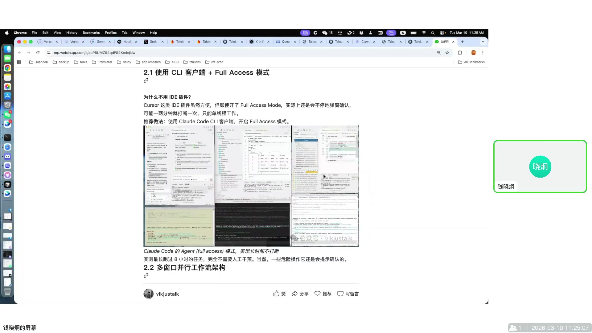
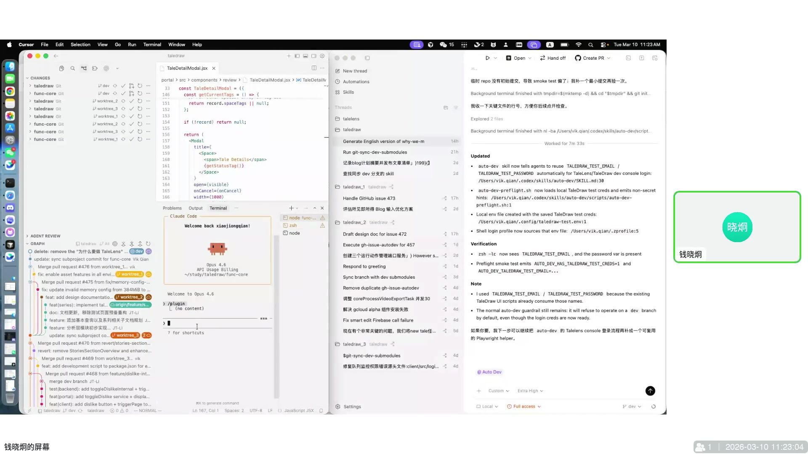
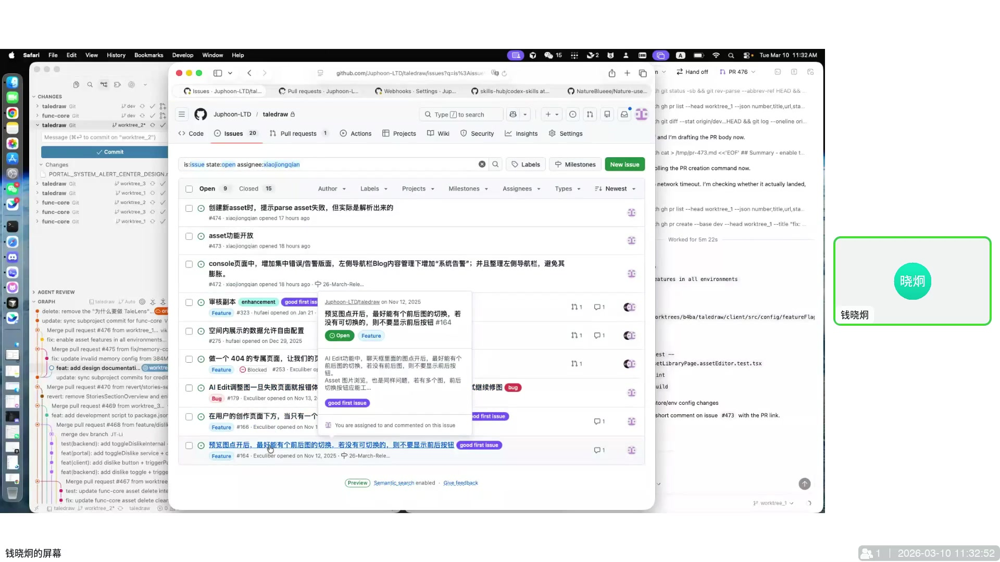
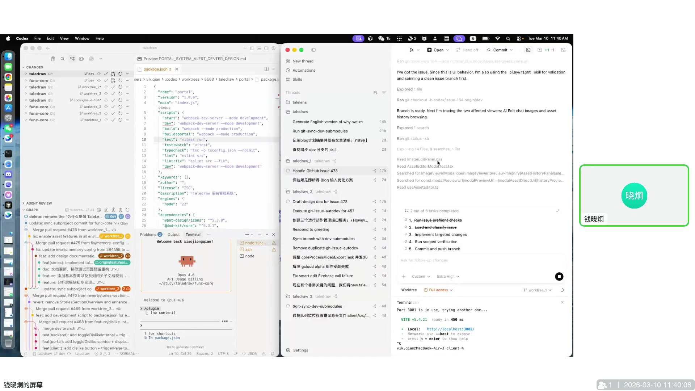
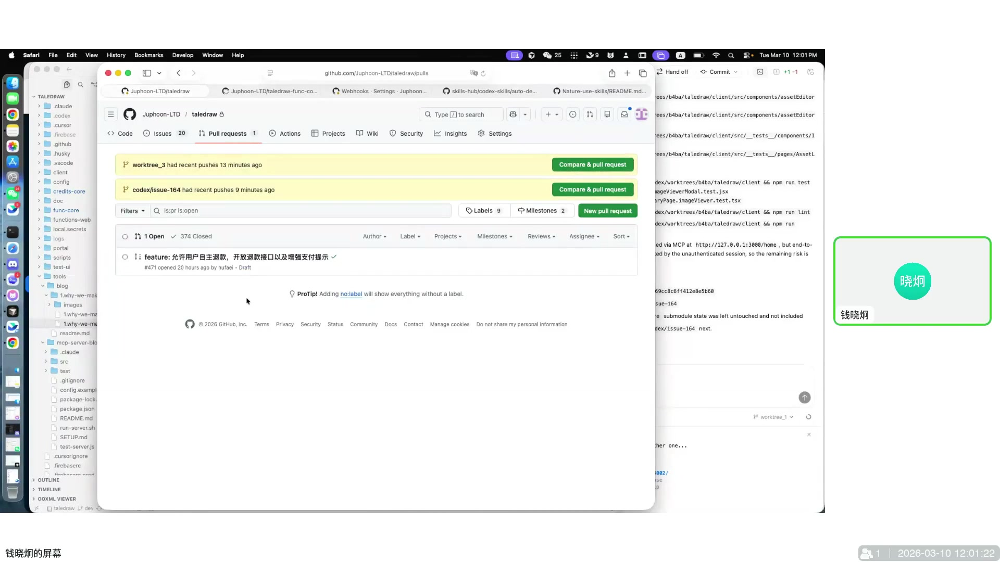

# 基于 AI Agent 的质量管理及并行开发工作流

> 这场分享讲的不是“怎么让 AI 多写一点代码”，而是怎么把 AI 真正接进工程流程里，同时把质量门禁、并行开发和自动验证一起立起来。



## 一、这场分享真正要解决的问题

很多团队现在都在用 AI 写代码，但真正卡住大家的，往往不是“模型会不会写”，而是下面这几个老问题：

- 改动做出来了，但质量不稳定，review 很难兜住所有问题。
- AI 能干活，但经常被权限确认、上下文切换、手工点点点打断。
- 一个需求拆成多条任务以后，怎么并行推进、怎么防止互相污染分支、怎么统一回收结果，缺少一套顺手的工程化方法。
- 自动化如果开得太猛，最后会变成“AI 自动提交了什么，人自己都不知道”。

这场分享给出的核心思路很直接：不要把 AI 当成一个聊天工具，而是把它变成一个能进入 Git、PR、测试、验收、发布链路的工程角色。但前提是，边界必须先画清楚。

## 二、质量门禁要前移，最好前移到“提交之前”

分享里有个很实用的观点：AI review 不是拿来最后补救的，而是拿来改变团队提交习惯的。

作者的做法是把 `code review skill` 提前放到提交流程里。结果不是简单多了一道检查，而是把大家的行为改掉了：

- 提交前先自己跑几轮 review。
- 先把代码 simplify，再去补充缺的验证。
- 目标不再是“先交上去再说”，而是“先把明显问题清掉再提 PR”。

这样做的价值有两个。

第一，AI 比人更适合扫大量重复性问题。人眼容易漏，AI 在统一规则下反而更稳定。  
第二，门禁一旦前移，团队会自然形成“先自检，再提交”的节奏，质量就不会全部压在最后一个 reviewer 身上。

换句话说，这套方法不是让 QA 更累，而是让 QA 从“事后补锅”变成“过程治理”。

## 三、并行开发不是多开几个窗口，而是先把隔离做好

分享里最有信息量的一段，是把 `Codex`、`Claude Code`、`git worktree` 和 `auto-dev` 拼成一套并行开发架构。

作者的分工很明确：

- `Codex` 负责开发，因为它慢一点，但成功率和代码可靠性更高。
- `Claude Code` 负责 review 和 merge，因为它反应快，适合做流程控制。

这个搭配背后的判断也很务实：工程里不怕慢一点，怕的是反复返工。开发阶段优先成功率，收口阶段优先流程执行力。



为了让并行开发可控，这套方法不是直接在主仓库里乱跑，而是把 AI 限制在 `worktree` 里：

- 每个任务对应一个独立 worktree。
- AI 只能在自己的 worktree 里改代码。
- 不允许直接提交到 `dev` 或 `main`。
- 所有结果统一通过 PR 回收。

这样做的好处非常明显：哪怕某个 AI 任务跑偏了，影响也被锁在那一个工作树里，不会把主分支搞脏。

一个典型动作，大概就是这样：

```bash
git worktree add ../repo-wt-164 -b issue-164 dev

# 在独立 worktree 中开发
# 运行 auto-dev / lint / test / playwright

gh pr create --draft

# 人工检查通过后，再切到 ready for review
```

这里最值得抄的，不是命令本身，而是这个约束思路：**先给 AI 足够大的操作空间，再用分支、worktree 和 PR 把风险框住。**

## 四、并行的前提，是任务入口统一、状态可见

如果要让多个 AI 实例同时干活，任务入口必须统一，不然最后只会变成一堆窗口同时开着，但没人知道谁在做什么。

作者的做法是让 issue 成为任务入口，再把任务分发给不同的 worktree 和线程：

- 从 issue 领取任务。
- 让 `GitHub issue auto dev` 或类似 skill 去接管开发。
- 一个线程做需求 A，另一个线程做设计优化，第三个线程做别的问题。



这套方式有两个工程好处：

1. 每个任务都有自然编号和上下文，不容易串线。
2. 做到一半时，主控窗口还能随时回看哪些任务完成了，哪些还卡着。

这就是为什么分享里反复提到“要有一个主控窗口”。并行开发不是全自动放养，而是一个人带着多个 agent 往前推。

## 五、自动验证一定要接进来，不然 AI 只是在替你制造回归

分享里还有一个很关键的判断：真正费精力的，常常不是写代码，而是验收测试。

他的做法不是等功能写完了再人工点，而是提前把“验证”写进计划里，再交给工具执行。这里重点提到了：

- 先写需求和设计。
- 再写工作计划。
- 每个计划都要带验证项。
- Web 验收优先用 `Playwright` 这种可重复执行的工具来跑。



这里有几个很实在的经验：

- 登录态、测试账号、密码这种前置条件，最好用环境变量注入。
- 长任务可以让 AI 连续跑两三个小时，甚至更久。
- 如果工具选得不好，权限、浏览器控制、页面状态这些细节会把人拖死。

所以这套流程的重点不是“找一个最炫的 AI 工具”，而是把验证也纳入流水线，让 agent 干完活之后，自己把该跑的也跑掉。

## 六、为什么最后还是要保留人工按钮

分享里最成熟的地方，不是“自动化更多”，而是知道自动化应该停在哪。

从技术上说，这套链路已经能做到很多自动动作：

- 自动领 issue
- 自动开发
- 自动提交 PR
- 自动触发 webhook
- 自动继续 review / merge
- 出问题再自动回抛 issue

但作者没有把它一路放开到底，而是在 PR 这一步刻意收口：AI 只允许提交 `draft PR`，真正要合并时，还是由人把状态改成 `ready for review`。



这个设计非常重要，因为它把“自动化能力”和“人工责任”分开了：

- AI 负责把工作推进到可审状态。
- 人负责最终确认结果是否值得进入主线。

这比“完全手工”高效，也比“完全自动”稳健。对于大多数团队来说，这其实是最合理的平衡点。

## 七、这套工作流里最值得抄走的 6 条原则

| 原则 | 说明 |
|------|------|
| 门禁前移 | 不要把质量问题全部留到 reviewer 那里才发现 |
| 开发与收口分工 | 开发看成功率，收口看执行力和稳定性 |
| worktree 隔离 | 给 AI 活动空间，但不要让它直接污染主分支 |
| issue 驱动并行 | 任务统一编号、统一入口、统一回收 |
| 验证写进计划 | 没有验证项的 AI 开发，迟早变成回归制造机 |
| 最后一跳人工确认 | 自动化可以很深，但主线入口最好留给人把关 |

## 八、如果你的团队要落地，可以从这 4 步开始

不需要一下子把整套系统全搭起来。更现实的做法是分四步：

1. 先把提交前的 `review skill` 跑起来，让团队习惯先自检。
2. 再把高风险改动迁到 `worktree + PR` 流程里，禁止直推主分支。
3. 接着把 `Playwright` 这类自动验收接进来，让验证不再全靠人工点击。
4. 最后再考虑 webhook、draft PR、自动回抛 issue 这些闭环能力。

这样推进的好处是，每走一步，团队都能立刻受益，而不是先花很大代价做一套“未来也许能用”的平台。

## 总结

这场分享最有价值的地方，在于它把一个常见误区讲清楚了：AI 工程化的重点，从来不是“怎么让模型更会写代码”，而是“怎么让它在可控的流程里持续产出结果”。

当质量门禁、任务隔离、自动验证和人工收口这几件事同时成立以后，AI 才真正从一个会说话的助手，变成一个能进入团队生产流程的工程角色。
